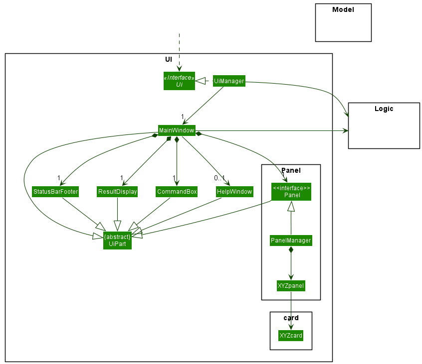
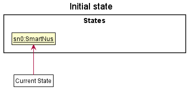
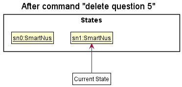
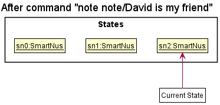
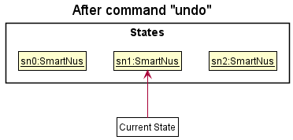
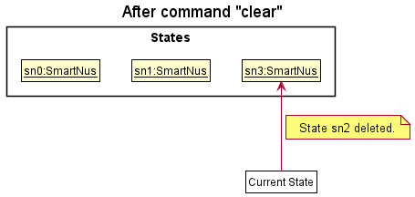

* Table of Contents
{:toc}

--------------------------------------------------------------------------------------------------------------------

## **Acknowledgements**

* This project is based on the AddressBook-Level3 project by [SE-EDU initiative](https://se-education.org).

--------------------------------------------------------------------------------------------------------------------

## **Setting up, getting started**

Refer to the guide [_Setting up and getting started_](SettingUp.md).

--------------------------------------------------------------------------------------------------------------------

## **Design**

:bulb: **Tip:** The `.puml` files used to create diagrams in this document can be found in the [diagrams](https://github.com/se-edu/addressbook-level3/tree/master/docs/diagrams/) folder. Refer to the [_PlantUML Tutorial_ at se-edu/guides](https://se-education.org/guides/tutorials/plantUml.html) to learn how to create and edit diagrams.

### Architecture

The ***Architecture Diagram*** given above explains the high-level design of the App.

Given below is a quick overview of main components and how they interact with each other.

**Main components of the architecture**

**`Main`** has two classes called [`Main`](https://github.com/se-edu/addressbook-level3/tree/master/src/main/java/seedu/address/Main.java) and [`MainApp`](https://github.com/se-edu/addressbook-level3/tree/master/src/main/java/seedu/address/MainApp.java). It is responsible for,
* At app launch: Initializes the components in the correct sequence, and connects them up with each other.
* At shut down: Shuts down the components and invokes cleanup methods where necessary.

[**`Commons`**](#common-classes) represents a collection of classes used by multiple other components.

The rest of the App consists of four components.

* [**`UI`**](#ui-component): The UI of the App.
* [**`Logic`**](#logic-component): The command executor.
* [**`Model`**](#model-component): Holds the data of the App in memory.
* [**`Storage`**](#storage-component): Reads data from, and writes data to, the hard disk.

**How the architecture components interact with each other**

The *Sequence Diagram* below shows how the components interact with each other for the scenario where the user issues the command `delete question 1`.

Each of the four main components (also shown in the diagram above),

* defines its *API* in an `interface` with the same name as the Component.
* implements its functionality using a concrete `{Component Name}Manager` class (which follows the corresponding API `interface` mentioned in the previous point.

For example, the `Logic` component defines its API in the `Logic.java` interface and implements its functionality using the `LogicManager.java` class which follows the `Logic` interface. Other components interact with a given component through its interface rather than the concrete class (reason: to prevent outside component's being coupled to the implementation of a component), as illustrated in the (partial) class diagram below.

The sections below give more details of each component.

### UI component

The **API** of this component is specified in [`Ui.java`](https://github.com/AY2122S1-CS2103T-F12-1/tp/blob/master/src/main/java/seedu/smartnus/ui/Ui.java)

The UI consists of a `MainWindow` that is made up of parts e.g.`CommandBox`, `ResultDisplay`, `QuestionListPanel`, `StatusBarFooter` etc. All these, including the `MainWindow`, inherit from the abstract `UiPart` class which captures the commonalities between classes that represent parts of the visible GUI.

The `UI` component uses the JavaFx UI framework. The layout of these UI parts are defined in matching `.fxml` files that are in the `src/main/resources/view` folder. For example, the layout of the [`MainWindow`](https://github.com/se-edu/addressbook-level3/tree/master/src/main/java/seedu/address/ui/MainWindow.java) is specified in [`MainWindow.fxml`](https://github.com/se-edu/addressbook-level3/tree/master/src/main/resources/view/MainWindow.fxml)

The `UI` component,

* executes user commands using the `Logic` component.
* listens for changes to `Model` data so that the UI can be updated with the modified data.
* keeps a reference to the `Logic` component, because the `UI` relies on the `Logic` to execute commands.
* depends on some classes in the `Model` component, as it displays `Question` object residing in the `Model`.

### Logic component

**API** : [`Logic.java`](https://github.com/AY2122S1-CS2103T-F12-1/tp/blob/master/src/main/java/seedu/smartnus/logic/Logic.java)

Here's a (partial) class diagram of the `Logic` component:

How the `Logic` component works:
1. When `Logic` is called upon to execute a command, it uses either the `SmartNusParser` or the `QuizInputParser` class to parse the user command.
1. This results in a `Command` object (more precisely, an object of one of its subclasses e.g., `AddCommand`) which is executed by the `LogicManager`.
1. The command can communicate with the `Model` when it is executed (e.g. to add a question).
1. The result of the command execution is encapsulated as a `CommandResult` object which is returned back from `Logic`.

The Sequence Diagram below illustrates the interactions within the `Logic` component for the `execute("delete question 1")` API call.

:information_source: **Note:** The lifeline for `DeleteCommandParser` should end at the destroy marker (X) but due to a limitation of PlantUML, the lifeline reaches the end of diagram.

Here are the other classes in `Logic` (omitted from the class diagram above) that are used for parsing a user command:

How the parsing works:
* When called upon to parse a user command, either the `SmartNusParser` class or the `QuizInputParser`class will create a `XYZCommandParser` (`XYZ` is a placeholder for the specific command name e.g., `AddCommandParser`) which uses the other classes shown above to parse the user command and create a `XYZCommand` object (e.g., `AddCommand`) which the `SmartNusParser` returns back as a `Command` object.
* All `XYZCommandParser` classes (e.g., `AddCommandParser`, `DeleteCommandParser`, ...) inherit from the `Parser` interface so that they can be treated similarly where possible e.g, during testing.

How the `Logic` component determines which parser to use:
- The `Logic` component uses either the `SmartNusParser` or the `QuizInputParser` class to parse the user command, depending on whether the user is entering the command while in a quiz.
- Different parsers are used due to different commands being available to the user during the quiz.
- The `LogicManager` class achieves this through the usage of overloaded methods, `parseCommand(String)` and `parseCommand(String, QuizManager)`, with the latter for parsing commands while in a quiz.
- This was implemented with the consideration that the `QuizInputParser` would require a `QuizManager` argument to be passed to various `XYZCommandParser` and `Command` classes to carry out the various quiz functionality.

### Model component
**API** : [`Model.java`](https://github.com/AY2122S1-CS2103T-F12-1/tp/blob/master/src/main/java/seedu/smartnus/model/Model.java)

The `Model` component,

* stores the smartNUS data i.e., all [`Question`](#question-class) and `Quiz` objects (which are contained in a `UniqueQuestionList` object).
* stores the currently 'selected' `Question` objects (e.g., results of a search query) as a separate _filtered_ list which is exposed to outsiders as an unmodifiable `ObservableList<Question>` that can be 'observed' e.g. the UI can be bound to this list so that the UI automatically updates when the data in the list change.
* stores another list of the currently 'selected' `Question` objects for a `Quiz` as a separate _filtered_ list which is also exposed to outsiders as an unmodifiable `ObservableList<Question>` that can be used in the Quiz UI
* stores a `UserPref` object that represents the user’s preferences. This is exposed to the outside as a `ReadOnlyUserPref` objects.
* does not depend on any of the other three components (as the `Model` represents data entities of the domain, they should make sense on their own without depending on other components)

:information_source: **Note:** An alternative (arguably, a more OOP) model is given below. It has a `Tag` list in the `SmartNus` model, which `Question` references. This allows `SmartNus` to only require one `Tag` object per unique tag, instead of each `Question` needing their own `Tag` objects. 

## Question class

The `Question` class is an abstract class that stores a name, importance, and any number of tags and `Choices`.
A `Choice` stores a name and a boolean value `isCorrect` representing if it is a correct answer to the `Question`.
The validity of a `Question` depends on the type of question.

Types of Questions currently supported by SmartNUS and their conditions for validity are:
1. Multiple Choice Questions
   * Has four `Choices` in total, exactly one of which is correct
2. True-False Questions
   * Has two `Choices` in total, which can only be "True" and "False", exactly one of which is correct
3. Multiple Response Questions (coming soon)
   * Has four `Choices` in total, at least one of which is correct
4. Open-Ended Questions (coming soon)

## Note class

The `Note` class is a class that stores a text.
The note of a `Note` depends on whether the note starts without a whitespace or not.

### Storage component

**API** : [`Storage.java`](https://github.com/AY2122S1-CS2103T-F12-1/tp/blob/master/src/main/java/seedu/smartnus/storage/Storage.java)

The `Storage` component,
* can save both address book data and user preference data in json format, and read them back into corresponding objects.
* inherits from both `SmartNusStorage` and `UserPrefStorage`, which means it can be treated as either one (if only the functionality of only one is needed).
* depends on some classes in the `Model` component (because the `Storage` component's job is to save/retrieve objects that belong to the `Model`)

### Common classes

Classes used by multiple components are in the `seedu.smartnus.commons` package.

--------------------------------------------------------------------------------------------------------------------

## **Implementation**

This section describes some noteworthy details on how certain features are implemented.

### \[Proposed\] Undo/redo feature

#### Proposed Implementation

The proposed undo/redo mechanism is facilitated by `VersionedSmartNus`. It extends `SmartNus` with an undo/redo history, stored internally as an `smartNusStateList` and `currentStatePointer`. Additionally, it implements the following operations:

* `VersionedSmartNus#commit()` — Saves the current address book state in its history.
* `VersionedSmartNus#undo()` — Restores the previous address book state from its history.
* `VersionedSmartNus#redo()` — Restores a previously undone address book state from its history.

These operations are exposed in the `Model` interface as `Model#commitSmartNus()`, `Model#undoSmartNus()` and `Model#redoSmartNus()` respectively.

Given below is an example usage scenario and how the undo/redo mechanism behaves at each step.

Step 1. The user launches the application for the first time. The `VersionedSmartNus` will be initialized with the initial address book state, and the `currentStatePointer` pointing to that single address book state.

Step 2. The user executes `delete 5` command to delete the 5th question in the address book. The `delete` command calls `Model#commitSmartNus()`, causing the modified state of the address book after the `delete 5` command executes to be saved in the `SmartNusStateList`, and the `currentStatePointer` is shifted to the newly inserted address book state.

Step 3. The user executes `add n/David …​` to add a new question. The `add` command also calls `Model#commitSmartNus()`, causing another modified address book state to be saved into the `smartNusStateList`.

:information_source: **Note:** If a command fails its execution, it will not call `Model#commitSmartNus()`, so the address book state will not be saved into the `smartNusStateList`.

Step 4. The user now decides that adding the question was a mistake, and decides to undo that action by executing the `undo` command. The `undo` command will call `Model#undoSmartNus()`, which will shift the `currentStatePointer` once to the left, pointing it to the previous address book state, and restores the address book to that state.

:information_source: **Note:** If the `currentStatePointer` is at index 0, pointing to the initial SmartNus state, then there are no previous SmartNus states to restore. The `undo` command uses `Model#canUndoSmartNus()` to check if this is the case. If so, it will return an error to the user rather
than attempting to perform the undo.

The following sequence diagram shows how the undo operation works:

:information_source: **Note:** The lifeline for `UndoCommand` should end at the destroy marker (X) but due to a limitation of PlantUML, the lifeline reaches the end of diagram.

The `redo` command does the opposite — it calls `Model#redoSmartNus()`, which shifts the `currentStatePointer` once to the right, pointing to the previously undone state, and restores the address book to that state.

:information_source: **Note:** If the `currentStatePointer` is at index `smartNusStateList.size() - 1`, pointing to the latest address book state, then there are no undone SmartNus states to restore. The `redo` command uses `Model#canRedoSmartNus()` to check if this is the case. If so, it will return an error to the user rather than attempting to perform the redo.

Step 5. The user then decides to execute the command `list`. Commands that do not modify the address book, such as `list`, will usually not call `Model#commitSmartNus()`, `Model#undoSmartNus()` or `Model#redoSmartNus()`. Thus, the `smartNusStateList` remains unchanged.

Step 6. The user executes `clear`, which calls `Model#commitSmartNus()`. Since the `currentStatePointer` is not pointing at the end of the `smartNusStateList`, all address book states after the `currentStatePointer` will be purged. Reason: It no longer makes sense to redo the `add n/David …​` command. This is the behavior that most modern desktop applications follow.

The following activity diagram summarizes what happens when a user executes a new command:

#### Design considerations:

**Aspect: How undo & redo executes:**

* **Alternative 1 (current choice):** Saves the entire address book.
  * Pros: Easy to implement.
  * Cons: May have performance issues in terms of memory usage.

* **Alternative 2:** Individual command knows how to undo/redo by
  itself.
  * Pros: Will use less memory (e.g. for `delete`, just save the question being deleted).
  * Cons: We must ensure that the implementation of each individual command are correct.

_{more aspects and alternatives to be added}_

### \[Proposed\] Data archiving

_{Explain here how the data archiving feature will be implemented}_

--------------------------------------------------------------------------------------------------------------------

## **Documentation, logging, testing, configuration, dev-ops**

* [Documentation guide](Documentation.md)
* [Testing guide](Testing.md)
* [Logging guide](Logging.md)
* [Configuration guide](Configuration.md)
* [DevOps guide](DevOps.md)

--------------------------------------------------------------------------------------------------------------------

## **Appendix: Requirements**

### Product scope

**Target user profile**:

* needs to organise and revise materials for many modules
* wants to note down important information in the form of questions and answers that they can quiz themselves on
* prefer desktop apps over other types
* can type fast
* prefers typing to mouse interactions
* is reasonably comfortable using CLI apps

**Value proposition**: organise and revise information faster than a typical mouse/GUI driven app

### User stories

Priorities: High (must have) - `* * *`, Medium (nice to have) - `* *`, Low (unlikely to have) - `*`

| Priority | As a …​                                    | I want to …​                     | So that I can…​                                                        |
| -------- | ------------------------------------------ | ------------------------------ | ---------------------------------------------------------------------- |
| `* * *`  | NUS Student | add a multiple choice question to the topic         | review the question in MCQ style|
| `* * *`  | NUS Student | add an answer to the multiple choice question       | see the correct answer during the review                                                                        |
| `* * *`  | NUS Student | add a note to remember things about mods | remember points about modules|
| `* * *`  | NUS Student | delete the question and at the same time delete all answers belonging to that question | remove questions and answer that are not needed|
| `* * *`  | NUS Student | do a quiz containing only questions from a certain tag       | revise questions for the specific tag|
| `* * *`  | NUS Student | specify the number of questions to be included in any quiz| revise the number of questions taking into account time constraints or the importance I place on that module/topic, rather than having to go through all questions|
| `* * *`  | NUS Student | see the list of all commands | know what commands to use to perform a specific task that I want|
| `* * *`  | NUS Student | specify the number of questions to be included in any quiz| revise the number of questions taking into account time constraints or the importance I place on that module/topic, rather than having to go through all questions|
| `* * *`  | NUS Student | add tags | tag questions to categorise them and search through them easily|
| `* * *`  | NUS Student | delete existing tag | delete unneeded tags|
| `* * *`  | NUS Student | add a True or False question to the topic | review the question in T/F style|
| `* * *`  | NUS Student | add an open ended question to the topic | review the question open endedly|
| `* * *`  | NUS Student | add an answer to the True or False question | see the correct answer during the review|
| `* * *`  | NUS Student | add an answer to the open ended question | see the correct answer during the review|
| `* * *`  | NUS Student | tag questions with custom tags (e.g. midterm, quiz, finals) | mark questions (add a note)|
| `* *`    | NUS Student | end the quiz mid way | end the quiz without finishing it, and return to question list|
| `* * `   | NUS Student | search questions by tag | filter out questions based on the specific tags|
| `* * `   | NUS Student | search questions by keyword | filter out questions based on the specific keyword|
| `* *`    | NUS Student | update existing tag | change a tag if there is a typo|
| `* *`    | NUS Student | edit the multiple choice question | amend the question just in case I made a mistake |
| `* *`    | NUS Student | edit the True or False question | amend the question just in case I made a mistake |
| `* *`    | NUS Student | edit the open ended question | amend the question just in case I made a mistake |
| `* *`    | NUS Student | edit the multiple choice answer | amend the answer just in case I made a mistake |
| `* *`    | NUS Student | edit the True or False answer | amend the answer just in case I made a mistake |
| `* *`    | NUS Student | edit the open ended answer | amend the answer just in case I made a mistake |
| `* *`    | NUS Student | mark a review as correct | track which questions I answered correctly |
| `* *`    | NUS Student | mark a review as incorrect | track which questions I need to review again |
| `*`      | NUS Student | undo a command | undo something that I did carelessly |
| `*`      | NUS Student | add an exam date to a tag | prioritize which modules to study for |
| `*`      | NUS Student | view how many times I have answered any question correctly and incorrectly | identify areas of improvement to focus on during revision|
| `*`      | NUS Student | view how many times I have answered questions from a particular topic correctly and incorrectly| identify areas of improvement to focus on during revision|
| `*`      | NUS Student | have Demo data already in the application [modules, QnA, tags]| see how the application works and try it out easily|
| `*`      | NUS Student | create a deadline (date) for the selected topic| manage my time to review topics|
| `*`      | NUS Student | view deleted questions | still see the questions I might need but have deleted|
| `*`      | NUS Student | restore deleted questions | to restore questions that I deleted but need again|
| `*`      | NUS Student | delete everything and start fresh | get rid of all data I have entered so far|
| `*`      | NUS Student | go back or forward in the question list | review again the questions I have answered |

### Use cases

(For all use cases below, the **System** is the `SmartNUS` and the **Actor** is the `user`, unless specified otherwise)

**Use case: List questions**

**MSS**

1.  User requests to list questions.
2.  SmartNUS displays a list of all stored questions.

**Extensions**

* 1a. User does not specify the keyword `question`.
* SmartNUS shows error message.
* 
  Use case ends.

**Use case: List notes**

**MSS**

1.  User requests to list notes.
2.  SmartNUS displays a list of all stored note.

**Extensions**

* 1a. User does not specify the keyword `note`.
* SmartNUS shows error message.

Use case ends.

**Use case: Add Multiple Choice question and options**

**MSS**

1.  User requests to add an MCQ question and its options, indicating the correct answer.
2.  SmartNUS saves the question, its options and the correct answer.

**Extensions**

* 1a. User does not specify any options.
* SmartNUS shows error message.

  Use case ends.

* 1b. User does not specify the correct answer.
* SmartNUS shows error message.
  
  Use case ends.

* 1c. User specifies more than one correct answer.
* SmartNUS shows error message.

  Use case ends.

**Use case: Add True/False question**

**MSS**

1.  User requests to add a True/False question, indicating the correct answer.
2.  SmartNUS saves the question and the correct answer.

**Extensions**

* 1a. User does not specify the correct answer.
    * 1a1. SmartNUS shows error message.

      Use case ends.

* 1b. User specifies more than one correct answer.
    * 1b1. SmartNUS shows error message.

      Use case ends.
      
* 1c. User does not specify an appropriate answer.
    * 1c1. SmartNUS shows error message.
    
        Use case ends.

**Use case: Delete a question**

**MSS**

1. User requests to list questions.
2. SmartNUS shows a list of all questions.
3. User requests to delete a specific question in the list.
4. SmartNUS deletes the question.

   Use case ends.

**Extensions**

* 2a. The list is empty.
    * 2a1. SmartNUS shows message that there are no questions.

      Use case ends.

* 3a. The given index is invalid.
    * 3a1. SmartNUS shows an error message.

      Use case resumes at Step 2.

**Use case: Delete a note**

**MSS**

1. User requests to list notes.
2. SmartNUS shows a list of all notes.
3. User requests to delete a specific note in the list.
4. SmartNUS deletes the note.

   Use case ends.

**Extensions**

* 2a. The list is empty.
    * 2a1. SmartNUS shows message that there are no notes.

      Use case ends.

* 3a. The given index is invalid.
    * 3a1. SmartNUS shows an error message.

      Use case resumes at Step 2.

**Use case: Tag a question**

**MSS**

1.  User requests to list questions.
2.  SmartNUS shows a list of all questions.
3.  User requests to tag a specific question in the list with specific tag(s).
4.  SmartNUS tags the question with the specified tags.  
    Use case ends.

**Extensions**

* 2a. The list is empty.
    * 2a1. SmartNUS shows message that there are no questions.

      Use case ends.

* 3a. The given index is invalid.
    * 3a1. SmartNUS shows an error message.

      Use case resumes at Step 2.

* 3b. At least one specified tag does not exist.
    * 3b1. SmartNUS creates tags that do not exist.

      Use case resumes at Step 4.

**Use case: List questions containing specific tags**

**MSS**

1. User requests to list questions containing specific tags.
2. SmartNUS shows a list of questions that contain at least one of the tags.

**Extensions**

* 1a. User does not specify any tags.
    * 1a1. SmartNUS shows an error message.

    Use case ends.

* 1b. User specifies tag names that are not alphanumeric.
    * 1b1. SmartNUS shows an error message.

    Use case ends.

* 2a. There are no questions in SmartNUS that contain at least one of the specified tags.
    * 2a1. SmartNUS shows message that there are no questions.

      Use case ends.

**Use case: Start a quiz**

**MSS**

1.  User requests to start a quiz, specifying number of questions and tags.
2.  SmartNUS shows a question from one of the specified tags and its options.
3.  User chooses one option.
4.  SmartNUS shows the correct option (answer).
5.  Steps 2 to 4 are repeated until the user has answered the number of questions he/she specified when starting the quiz.
6.  SmartNUS shows the user’s score (number of questions correct and total number of questions answered).

**Extensions**

* 1a. Number of questions is invalid (negative or more than total number of questions).
    * 1a1. SmartNUS shows error message.

      Use case ends.

* 1b. At least one tag does not exist.
    * 1b1. SmartNUS shows an error message.

      Use case ends.

* 2a. User did not specify any tags.
    * 2a1. SmartNUS shows any question (that has not yet been shown in the quiz) and its options.

      Use case resumes at Step 3.

* 5a. User did not specify number of questions.
    * 5a1. Steps 2 to 4 are repeated until all questions from the specified tags have been shown.

      Use case resumes at Step 6.

### Non-Functional Requirements

1. Should work on any _mainstream OS_ as long as it has Java `11` or above installed.
2. Should be able to hold up to 1000 questions without a noticeable sluggishness in performance for typical usage.
3. A student with above average typing speed for regular English text (i.e. not code, not system admin commands) should be able to accomplish most of the tasks faster using commands than using the mouse.
4. The data should be stored locally and should be in an editable json file.
5. The product should be for a single user at a time.
6. The final product should be a result of morphing the given AB3 code base.
7. The final product should be self-contained i.e should not prompt the user to open any links.
8. The final product should be fully functional without the internet.

### Glossary

* **Mainstream OS**: Windows, Linux, Unix, OS-X

--------------------------------------------------------------------------------------------------------------------

## **Appendix: Instructions for manual testing**

Given below are instructions to test the app manually.

:information_source: **Note:** These instructions only provide a starting point for testers to work on;
testers are expected to do more *exploratory* testing.

### Launch and shutdown

1. Initial launch

   1. Download the jar file and copy into an empty folder

   1. Double-click the jar file Expected: Shows the GUI with a set of sample contacts. The window size may not be optimum.

1. Saving window preferences

   1. Resize the window to an optimum size. Move the window to a different location. Close the window.

   1. Re-launch the app by double-clicking the jar file. 
       Expected: The most recent window size and location is retained.

1. _{ more test cases …​ }_

### Deleting a question

1. Deleting a question while all questions are being shown

   1. Prerequisites: List all questions using the `list` command. Multiple questions in the list.

   1. Test case: `delete 1` 
      Expected: First contact is deleted from the list. Details of the deleted contact shown in the status message. Timestamp in the status bar is updated.

   1. Test case: `delete 0` 
      Expected: No question is deleted. Error details shown in the status message. Status bar remains the same.

   1. Other incorrect delete commands to try: `delete`, `delete x`, `...` (where x is larger than the list size) 
      Expected: Similar to previous.

1. _{ more test cases …​ }_

### Saving data

1. Dealing with missing/corrupted data files

   1. _{explain how to simulate a missing/corrupted file, and the expected behavior}_

1. _{ more test cases …​ }_
